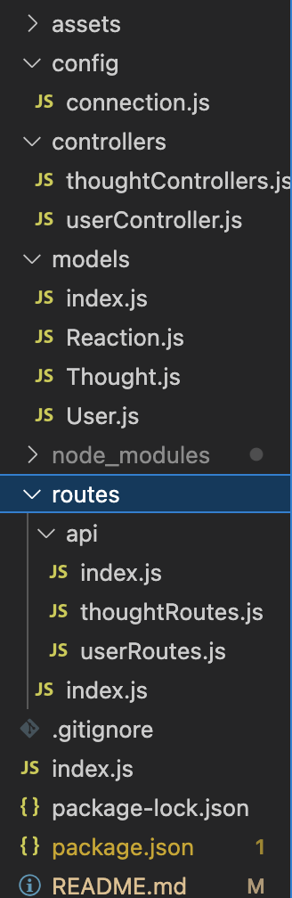

# NoSQL_Social_Network_API

**What does this application do and why?**

* As a developer working on a social network, I want a working back end social networking website that uses a flexible database (MongoDB)
* This back end app has all necessary models and routes to connect to a functioning front-end: 
    - Ability to create, update, and delete a user
    - Ability to add and remove a friend to a user
    - Ability to create, update, and delete a thought associated with a user
    - Ability to create and delete reactions to other's thoughts
* Using mongo and mongoose, this app has the ability to create and manipulate a flexible database and access information using each route

**How the application is organized**
The NoSQL Social Network is organized in the following files:

**Step-by-Step on how to run the application**
* Run the application on a local host using the command "npm start"
* Using a third party route checking app such as insomnia, connect to the local host
* Using the routes that are defined in the code, use the GET, POST, PUT, and DELETE routes to manipulate and view the database  

**What the application looks like**

Link to Video of the functioning routes: ![Link]https://watch.screencastify.com/v/UCWPtOh5aywHJqLIFa5w

**Link to GitHub Repository**

GitHub Repository: ![Link] 

**Technologies Used** 

* Express
* Express routing
* javascript
* Node
* MongoDB
* mongoose
* moment.js
